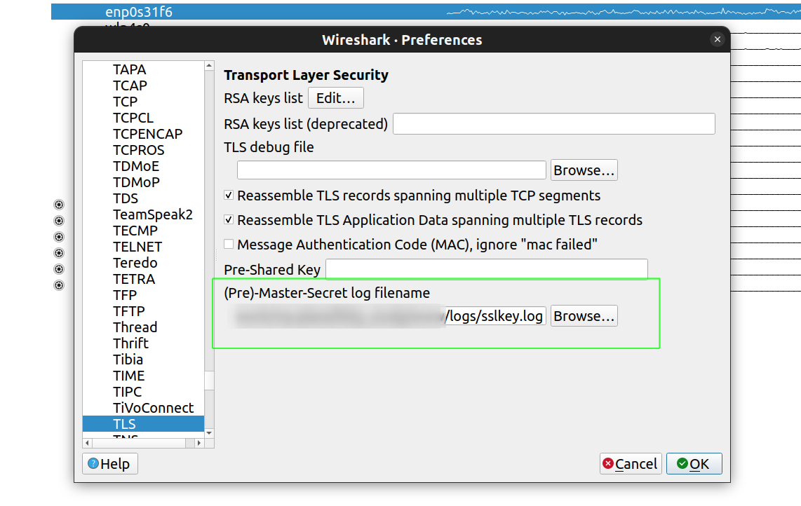

# Decrypt HTTPS(TLS) traffic via Chrome and Wireshark on Ubuntu 22.04

## Environment 
* Ubuntu 22.04
* Google Chrome	110.0.5481.77
* Wireshark 3.6.7

## Step by step
* Close Chrome completely. You can check in **system monitor**, make sure all instances are closed, otherwise kill them all =)

* Open a terminal window and set the `SSLKEYLOGFILE` as a environment variable.(just works for this terminal before it's closed, So **DON'T** close it!!!)
  ```bash
  # specify the log file and export it's path as a env
  export SSLKEYLOGFILE=/home/xxx/xxx/http_study/www/logs/sslkey.log

  # you can check by this command
  echo $SSLKEYLOGFILE
  # output will be "/home/xxx/xxx/http_study/www/logs/sslkey.log"
  ```

* Launch Wireshark, and start to capture package
  ```bash
  sudo Wireshark 
  ```

* Launch Chrome using the terminal window **in step 2**.
  ```bash
  google-chrome-stable
  ```

* Verify that `sslkey.log`file is created
  ```bash
  # go to dictionary to check or 
  # use the command 
  file /home/xxx/xxx/http_study/www/logs/sslkey.log
  # output will be 
  /home/xxx/xxx/http_study/www/logs/sslkey.log: ASCII text
  ```

* Browse to the website you wanna test and check in Wireshark to confirm that all activities are captured.

* In Wireshark go to **Edit > Preferences > Protocols > TLS**, config the pew-master-secret log filename.


* The decrypted package is displayed in Wireshark if you're lucky =)
